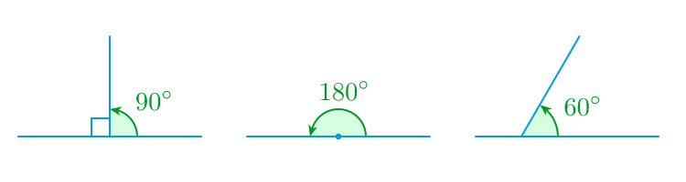

----

# Chapter Fifteen Radians

----

Radian is a way to measure angles.

Before, you would write angles in **degrees**...

Now, you can also write angles in **radians**...

Don't get it? Don't worry, we'll go through it step by step.
