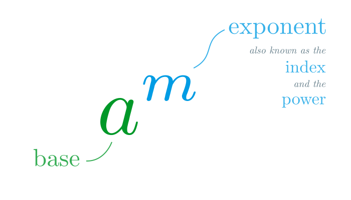

# Index Notation

Index notation is a way of writting powers.

> Note: the plural of index is indices

Using index notation,
\\[
\color{#009ce4}{
    \underbrace{
        \color{#009828}{a \times a \times a \times \dotsb \times a}
    }_{\text{\\(m\\) times}}
}
=
\color{#009828}{a}^{\color{#009ce4}m} \,,
\\]
where \\(\color{#009828}a\\) is the **base**, and \\(\color{#009ce4}m\\) is the **index** (also known as the *exponent* and the *power*).

We say ``\\(a\\) to the power \\(m\\)'', or even just ``\\(a\\) to the \\(m\\)'' since it's easier to say out loud.

